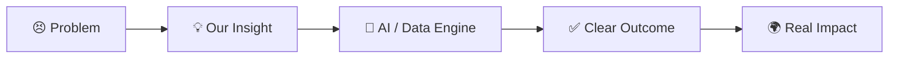
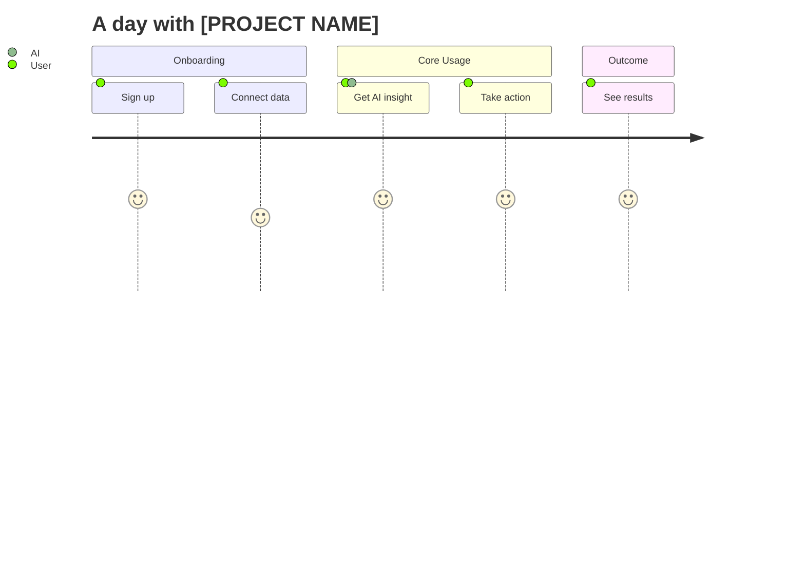
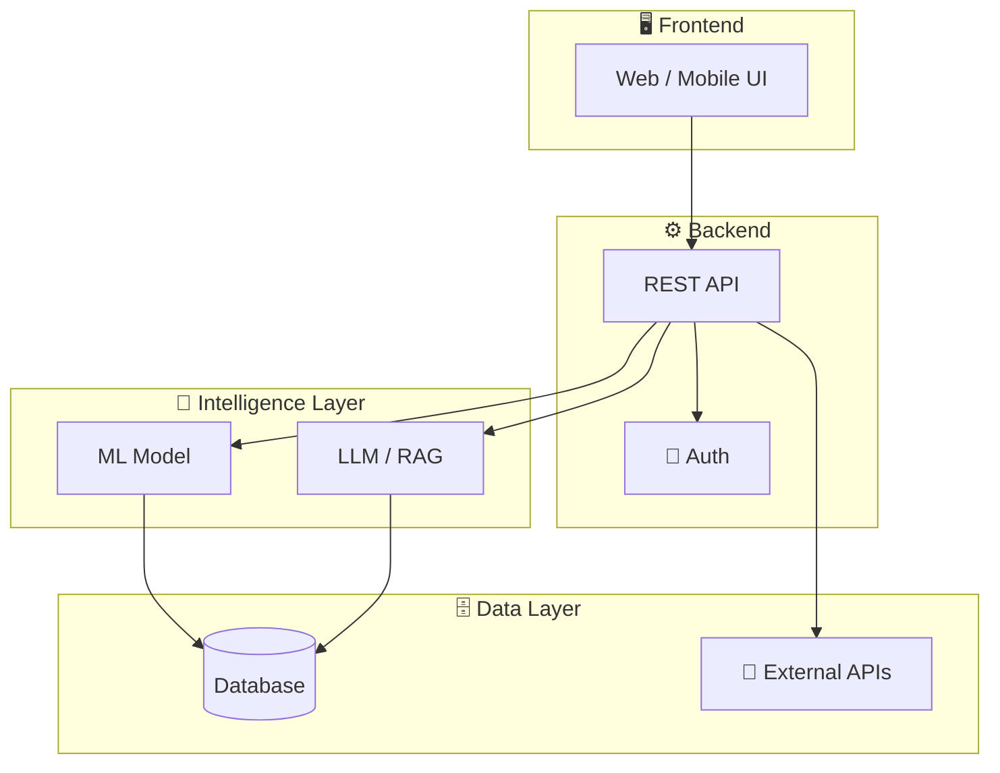

<!-- ═══════════════════════════════════════════════════════════════
     HOW TO USE THIS TEMPLATE
     1. Replace everything in [BRACKETS] or marked "TODO".
     2. Delete sections you don't need.
     3. Put images in /assets (banner.png, logo.png, demo.gif, architecture.png).
     4. Remove these comments before submitting.
════════════════════════════════════════════════════════════════ -->

<div align="center">

<!-- Logo: replace with your own -->


# 🚀 [PROJECT NAME]

### *[One-line tagline that sells your idea in under 10 words]*

<!-- Badges -->


[🎬 Live Demo](#) • [📽️ Video Pitch](#) • [📊 Slides](#) • [📖 Docs](#) • [🐛 Report Bug](../../issues)

<!-- Banner / hero screenshot or GIF -->


</div>

## 🎯 The Problem

> **TODO:** Open with a striking fact or a relatable story.

| 😣 Pain Point | 📉 Who It Hurts | 📊 Evidence |
|---|---|---|
| [Pain point 1] | [e.g. SMEs, students, retail investors] | [Stat + source] |
| [Pain point 2] | [Group] | [Stat + source] |
| [Pain point 3] | [Group] | [Stat + source] |

<div align="center">

**💬 "[A powerful one-sentence statement of the problem]"**

</div>

---

## 💡 Our Solution

**[PROJECT NAME]** is a [type of product, e.g. AI-powered credit scoring platform] that helps **[target users]** to **[achieve what]** by **[how, in simple terms]**.

### The Idea in 30 seconds



## ✨ Key Features

<table>
<tr>
<td width="33%" align="center">

### 🤖
**[Feature 1]**

[One line describing the benefit]

</td>
<td width="33%" align="center">

### 📊
**[Feature 2]**

[One line describing the benefit]

</td>
<td width="33%" align="center">

### 🔐
**[Feature 3]**

[One line describing the benefit]

</td>
</tr>
<tr>
<td width="33%" align="center">

### ⚡
**[Feature 4]**

[One line describing the benefit]

</td>
<td width="33%" align="center">

### 🌐
**[Feature 5]**

[One line describing the benefit]

</td>
<td width="33%" align="center">

### 📱
**[Feature 6]**

[One line describing the benefit]

</td>
</tr>
</table>

---

## 🎬 Demo

<div align="center">

| 🖥️ Dashboard | 📱 Mobile View | 📈 Analytics |
|:---:|:---:|:---:|
|  |  |  |


**▶️ [Watch the full demo video](#)**

</div>

### 🧭 User Journey



---

## 🏗️ Architecture

<div align="center">

</div>



---

## 📂 Project Structure

```text
📦 REPO
 ┣ 📂 assets/          # Images, GIFs, logos
 ┣ 📂 backend/         # API & business logic
 ┃ ┣ 📂 app/
 ┃ ┗ 📜 requirements.txt
 ┣ 📂 frontend/        # UI code
 ┣ 📂 models/          # Trained models & notebooks
 ┣ 📂 data/            # Sample / processed data
 ┣ 📂 docs/            # Extra documentation
 ┣ 📜 docker-compose.yml
 ┣ 📜 .env.example
 ┗ 📜 README.md
```

---

## 🧰 Tech Stack

<div align="center">

| Layer | Technologies |
|:---:|:---|
| 🎨 **Frontend** |    |
| ⚙️ **Backend** |    |
| 🤖 **AI / ML** |     |
| 📊 **Data** |    |
| 🗄️ **Database** |    |
| ☁️ **DevOps** |    |
| 🔗 **FinTech** |   |

</div>

> 💡 Find more badges at [shields.io](https://shields.io) and [simpleicons.org](https://simpleicons.org).

---

## 📊 Data & Model

<details>
<summary><b>🗂️ Datasets (click to expand)</b></summary>

| Dataset | Source | Size | License |
|---|---|---|---|
| [Name] | [URL] | [N rows] | [License] |
| [Name] | [URL] | [N rows] | [License] |

</details>

<details>
<summary><b>🧪 Model & Methodology (click to expand)</b></summary>

1. **Data Cleaning** – [what you did]
2. **Feature Engineering** – [key features]
3. **Model** – [algorithm, why chosen]
4. **Evaluation** – [metrics: AUC, F1, RMSE...]
5. **Explainability** – [SHAP / LIME / etc.]

</details>

---

## 📈 Results & Impact

<div align="center">

| 🎯 Accuracy | ⚡ Latency | 💰 Cost Saved | 👥 Users Reached |
|:---:|:---:|:---:|:---:|
| **[XX%]** | **[XX ms]** | **[XX%]** | **[XXX]** |


</div>

### 🌍 Business & Social Value
- 💼 **Market size:** [TAM / SAM / SOM]
- 🌱 **Financial inclusion:** [how it helps underserved groups]
- 🔄 **Scalability:** [how it grows]
- 💵 **Business model:** [subscription / API / commission]

---

## 🚀 Getting Started

### ✅ Prerequisites

- 
- 
- 

### ⚡ Quick Start

```bash
# 1️⃣ Clone the repo
git clone https://github.com/USERNAME/REPO.git
cd REPO

# 2️⃣ Set up environment variables
cp .env.example .env

# 3️⃣ Install dependencies
pip install -r requirements.txt
cd frontend && npm install && cd ..

# 4️⃣ Run the app
docker-compose up --build
# or manually:
# uvicorn app.main:app --reload
# npm run dev --prefix frontend
```

🌐 Open **http://localhost:3000** and enjoy!

<div align="center">

### 🏷️ Team **NoCoders.AI**
*[Short team motto or story]*

| | | | | |
|:---:|:---:|:----:|:---:|:---:|
| <br/>**Nurali Zhan**<br/>🧠 *AI / ML / Backend*<br/>[](https://github.com/ururu9339) [](#) | <br/>**[Askaruly Ali]**<br/>⚙️ *Backend Developer*<br/>[](https://github.com/USERNAME2) [](#) | <br/>**[Rahim Akanov]**<br/>*empty*<br/>[](https://github.com/USERNAME3) [](#) | <br/>**[Dossymov Amirkhan]**<br/>📊 *Data Analyst / Pitch*<br/>[](https://github.com/USERNAME4) [](#) | <br/>**[Name 5]**<br/>📊 *Data Analyst / Pitch*<br/>[](https://github.com/USERNAME4) [](#) |

🎓 **University:** [Xiamen University Malaysia] &nbsp;|&nbsp; 🌏 **Country:** [Malaysia] &nbsp;|&nbsp; 📧 **Contact:** [nocoders.ai@gmail.com]

</div>

---

## 🏆 Hackathon Info

| | |
|---|---|
| **Event** | 2026 Shenzhen International FinTech Competition (FinTechathon) |
| **Challenge** | Xili Lake FinTech University Student Challenge |
| **Track** | 🤖 Artificial Intelligence |
| **Official Site** | [fintechathon.g-ican.com](https://fintechathon.g-ican.com) |

---

## 📜 License

Distributed under the **MIT License**. See [`LICENSE`](LICENSE) for details.

---

<div align="center">

### ⭐ If you like our idea, give us a star! ⭐

**Made with tears and no sleep by Team NoCoders.AI**


</div>
